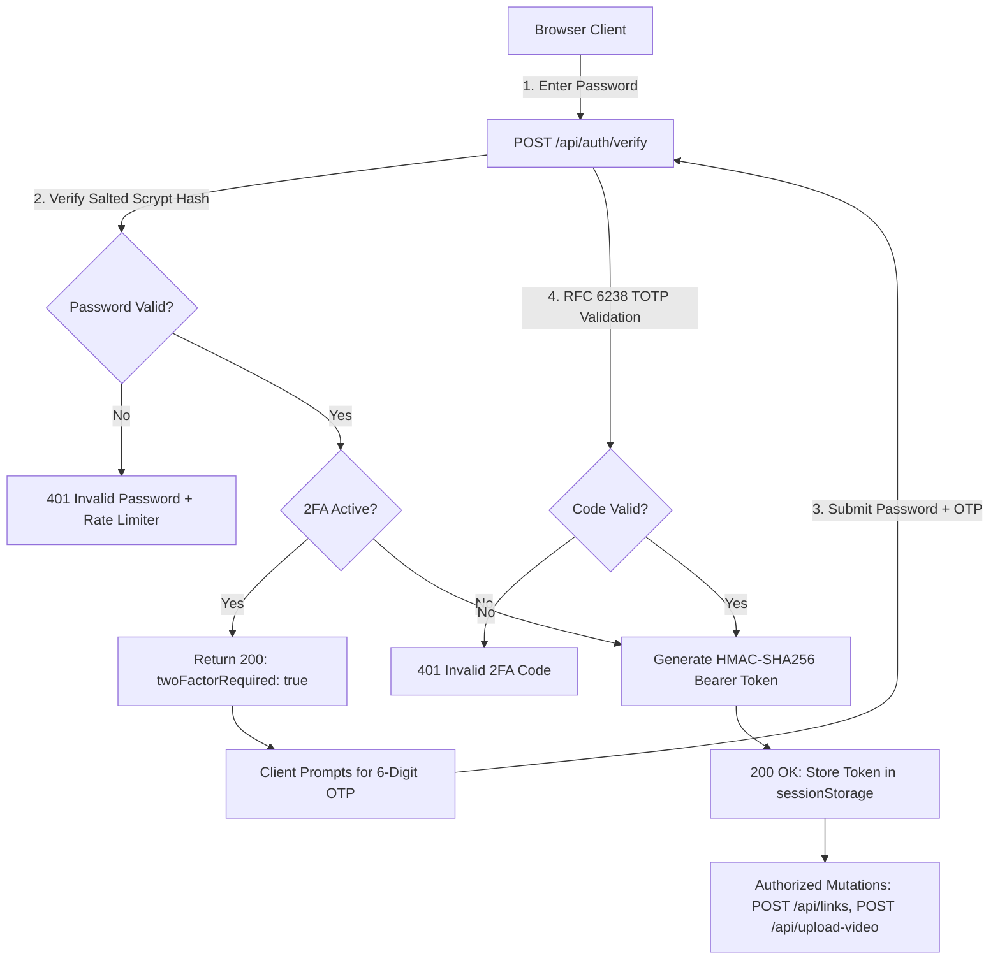

<div align="center">

# 🕹️ KV-Port (Khoa.vo Portal)

<p><em>Where design meets intelligence. A dynamic, Tetris-inspired personal dashboard, service hub, and app launcher.</em></p>

[](https://react.dev/)
[](https://vitejs.dev/)
[](https://nodejs.org/)
[](SECURITY.md)
[](SECURITY.md)
[](https://hub.docker.com/r/vndangkhoa/kv-port)
[](https://github.com/vndangkhoa/kv-port/pkgs/container/kv-port)
[](https://git.khoavo.myds.me/vndangkhoa/kv-port)
[](LICENSE)

[Features](#-key-features) • [Security & 2FA](#-security--two-factor-authentication) • [Quick Start](#-quick-start) • [Docker Deployment](#-docker-deployment) • [NAS Deployment](#-nas-deployment-synology--qnap) • [Changelog](#-changelog)

</div>

---

## 🌟 Overview

**KV-Port** is an ultra-fast, responsive personal portal and home lab service launcher built with a procedural **Tetris-tiling layout engine**. Every application card is represented as a tetromino piece that dynamically falls and locks into place upon page load. 

It includes real-time administrative controls, customizable colors, embedded background video resumes with byte-range streaming, enterprise-grade multi-factor security (**2FA / TOTP**), and zero external runtime dependencies on production hosts or Synology NAS setups.

---

## ✨ Key Features

- 🧩 **Procedural Tetris Layout Engine**: Backtracking solver automatically computes optimal interlocking tetromino configurations based on viewport aspect ratio and item count.
- 📐 **Pixel-Perfect Seamless Blocks**: Individual blocks are rendered as continuous HTML elements clipped with SVG `clipPath` and extended via CSS `calc()`, eliminating internal borders while preserving precise inter-card gutters.
- 🔐 **Built-In Two-Factor Authentication (2FA)**: RFC 6238 compliant TOTP engine built natively with `node:crypto`. Protect your admin session with Google Authenticator, Apple Keychain, 1Password, or Authy.
- 🛡️ **Zero-Dependency Security Architecture**: Salted `scrypt` password hashing, timing-safe verification, HMAC-SHA256 session tokens, brute-force IP rate limiting, and magic-byte video upload validation.
- 🎬 **Media & Video Resume Streaming**: Supports background videos with HTTP 206 Partial Content range requests for smooth seeking and playback across Safari, Chrome, iOS, and Android.
- 🛠️ **Live Admin Management**: Press `Ctrl+Shift+A` (or `Cmd+Shift+A` on macOS) or click the **Admin** button to open the management panel. Add, delete, reorder, adjust colors, and edit links in real time.
- 🔄 **True Multi-Device Persistence**: Edits made in the Admin panel synchronize with the central server and persist across all machines, smartphones, and tablets.
- 📱 **Adaptive Viewport Scaling**: Fluidly transitions between landscape (desktop) and portrait (mobile) layouts without awkward horizontal or vertical scrollbars.
- 🌓 **Themes & Layout Controls**: Instant Dark/Light mode switcher and dynamic shuffle button to re-roll tetromino layout configurations.
- 🚀 **Zero-Dependency Production Backend**: Standalone `server.js` uses native Node.js standard libraries—no external npm modules needed on your Synology NAS or production server!

---

## 🔐 Security & Two-Factor Authentication

Designed from the ground up for safe public exposure at `https://khoavo.myds.me/`:



### Security Highlights
| Security Control | Implementation |
| :--- | :--- |
| **Two-Factor Authentication** | RFC 6238 TOTP with QR Code scanner & manual key entry. |
| **Password Storage** | Cryptographic `scrypt` hashing with unique 16-byte random salts. |
| **Timing Attack Defense** | `crypto.timingSafeEqual` prevents side-channel analysis. |
| **API Protection** | Mutating endpoints require `Authorization: Bearer <token>`. |
| **Brute-Force Defense** | Automatic 15-minute IP lockout after 5 consecutive failed attempts. |
| **Upload Safety** | Strict extension checks (`.mp4`, `.webm`) + binary magic-byte inspection (`ftyp`, EBML). |
| **HTTP Security Headers** | Strict `CSP`, `X-Frame-Options: DENY`, `X-Content-Type-Options: nosniff`, `HSTS`. |

> See [SECURITY.md](SECURITY.md) for full architecture details and Synology NAS reverse proxy recommendations.

---

## 🏗️ Architecture & Project Structure

```text
kv-port/
├── server.js              # Hardened zero-dependency production HTTP & API server
├── Dockerfile             # Multi-stage production container build
├── docker-compose.yml     # Container orchestration with persistent volumes
├── launch.sh              # Unified developer & deployment CLI script
├── dist/                  # Production build output (HTML, JS, CSS)
├── data/                  # Persistent runtime JSON database (links.json, auth.json)
├── uploads/               # Persistent uploaded media & videos
├── src/
│   ├── App.jsx            # Main application root & layout orchestration
│   ├── components/
│   │   ├── AdminModal.jsx # Administration modal with 2FA wizard & link editor
│   │   └── ...            # Illustrations and card components
│   ├── data/              # Default starter seed data (links.json, auth.json)
│   └── utils/
│       ├── gridCalculator.js  # Dynamic column/row optimization
│       └── videoStorage.js    # IndexedDB caching utilities
├── SECURITY.md            # Hardening guide & Synology exposure best practices
└── vite.config.js         # Vite bundling configuration & dev API middleware
```

---

## 🚀 Quick Start

### 1. Using the Unified CLI (`launch.sh`)

```bash
# Start local development server (http://localhost:5173)
./launch.sh dev

# Expose dev server to local network (LAN)
./launch.sh dev --host

# Build for production
./launch.sh build

# Start production server locally (http://localhost:3000)
./launch.sh start
```

### 2. Standard NPM Workflow

```bash
# Install dependencies
npm install

# Start development mode
npm run dev

# Build production bundle
npm run build

# Start production server
npm start
```

---

## 🐳 Docker Deployment

The image is automatically built, optimized, and pushed to 3 major container registries:

- **Docker Hub**: `vndangkhoa/kv-port:latest`
- **GitHub Container Registry (GHCR)**: `ghcr.io/vndangkhoa/kv-port:latest`
- **Forgejo Registry**: `git.khoavo.myds.me/vndangkhoa/kv-port:latest`

### Running with Docker Compose (Recommended)

Save the following as `docker-compose.yml`:

```yaml
services:
  kv-port:
    image: vndangkhoa/kv-port:latest
    container_name: kv-port
    restart: unless-stopped
    ports:
      - "3000:3000"
    volumes:
      - ./data:/app/data
      - ./uploads:/app/uploads
    environment:
      - PORT=3000
      - HOST=0.0.0.0
```

Start the container:
```bash
docker compose up -d
```

### Building & Running Locally

```bash
docker build -t kv-port .
docker run -d -p 3000:3000 -v $(pwd)/data:/app/data -v $(pwd)/uploads:/app/uploads kv-port
```

---

## 💾 NAS Deployment (Synology / QNAP)

### Method 1: Synology Container Manager (Docker)

1. Open **Container Manager** (or Docker) on Synology DSM.
2. Go to **Project** > **Create**.
3. Point to the folder containing `docker-compose.yml` (or paste the YAML content).
4. Deploy the project! Your links, 2FA secret, and videos persist automatically in `./data` and `./uploads`.

### Method 2: Native Node.js (Zero `npm install` on NAS!)

1. Run the build locally on your development machine:
   ```bash
   ./launch.sh build
   ```
2. Copy these 4 folders/files to your NAS web folder (e.g. `/volume1/web/kv-port`):
   - `dist/`
   - `data/`
   - `uploads/`
   - `server.js`
3. Run directly with Node.js:
   ```bash
   node server.js
   # Or with custom port:
   PORT=3000 node server.js
   ```

---

## 🔑 Initial Setup & Enabling 2FA

1. Launch your portal (`http://localhost:3000` or `https://khoavo.myds.me`).
2. Press `Ctrl + Shift + A` (or `Cmd + Shift + A`) or click the **Admin** button in the header.
3. Enter the initial password:
   ```text
   thieugia
   ```
4. Navigate to the **Security & 2FA** tab:
   - **Update Password**: Set your own private password.
   - **Setup 2FA**: Click **Setup Two-Factor Authentication**, scan the QR code using Google Authenticator, Apple Keychain, 1Password, or Authy, and enter the 6-digit confirmation code.
5. All future logins will now require both your password and your 6-digit authenticator code.

---

## 📝 Changelog

### [v1.2.0] - 2026-09-13 (Security & 2FA Release)

#### Added
- **Two-Factor Authentication (TOTP / 2FA)**: Native RFC 6238 TOTP engine built into `server.js` and `vite.config.js` with zero runtime npm dependencies.
- **Interactive QR Code Setup**: Added QR code generator and Base32 secret manual key copy in the Admin Modal for one-click setup with Google Authenticator, Apple Keychain, 1Password, and Authy.
- **Two-Step Login UI**: Clean 2-step verification flow with 6-digit formatted inputs and numeric paste support.
- **Cryptographic Password Security**: Upgraded credential storage from plaintext to salted `scrypt` hashing with constant-time comparison (`crypto.timingSafeEqual`).
- **HMAC-SHA256 Session Tokens**: Replaced unauthenticated write APIs with signed Bearer session tokens required on `/api/links`, `/api/upload-video`, `/api/auth/password`, and 2FA endpoints.
- **Brute-Force Rate Limiter**: In-memory IP tracking locks out attackers for 15 minutes after 5 consecutive failed attempts (`429 Too Many Requests`).
- **Binary Magic-Byte Upload Hardening**: Video uploads are verified using file signatures (`ftyp` for MP4, `1A 45 DF A3` for WebM) to prevent disguised scripts and Stored XSS.
- **HTTP Security Headers**: Injected `Content-Security-Policy`, `X-Frame-Options: DENY`, `X-Content-Type-Options: nosniff`, `Referrer-Policy: strict-origin-when-cross-origin`, and `Strict-Transport-Security`.
- **Multi-Registry Publishing**: Built and pushed official container images to Docker Hub (`vndangkhoa/kv-port`), GitHub Container Registry (`ghcr.io/vndangkhoa/kv-port`), and Forgejo (`git.khoavo.myds.me/vndangkhoa/kv-port`).

#### Fixed
- Fixed unauthenticated `POST /api/links` and `POST /api/upload-video` endpoints that previously allowed arbitrary public writes.
- Fixed dev server authentication mismatch where `vite.config.js` failed to recognize hashed credentials.
- Removed hardcoded fallback password check from client-side code.

---

### [v1.1.0] - 2026-09-13

#### Added
- **Multi-Device Sync Architecture**: Integrated persistent production backend `server.js` using Node.js standard libraries (`node:http`, `node:fs`), resolving isolated browser `localStorage` drift.
- **Docker Support**: Added multi-stage `Dockerfile` and `docker-compose.yml` with persistent volume mappings for `./data` and `./uploads`.
- **Media Streaming**: Added HTTP 206 Partial Content range requests for native scrubbing and playback of video resume backgrounds on mobile and desktop.
- **Enhanced Admin Feedback**: Visual confirmation in Admin UI indicating whether edits synced to the central server (`✓ Saved & synced across all devices!`) or fell back to offline storage (`⚠ Saved locally only`).
- **Unified CLI Tooling**: Added `start` and automatic directory preparation inside `launch.sh`.

#### Fixed
- Fixed issue where modifications in the Admin page only took effect on the editing browser and did not replicate to other devices accessing the NAS.
- Resolved missing `/api/links` handling in static production builds.

---

### [v1.0.0] - Initial Release

- Initial release with procedural tetromino tiling grid.
- Dynamic responsive aspect-ratio switching (8×6 desktop, 6×8 mobile).
- Seamless SVG `clipPath` card geometry.
- Dark and light theme support.
- Embedded video resume tile and animated hover interactions.

---

## 📄 License

This project is licensed under the [MIT License](LICENSE).

---

<div align="center">
  <sub>Built with ❤️ by <b>Khoa.vo</b></sub>
</div>